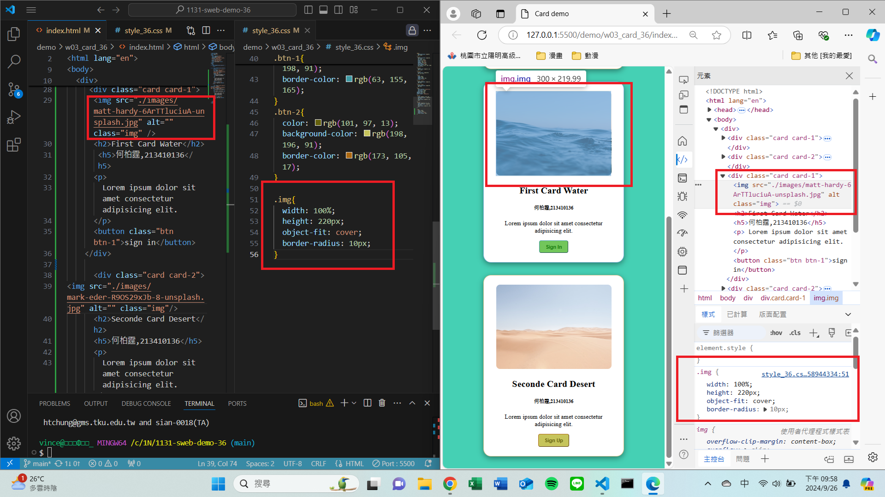

[My Github URL](https://github.com/vincent560/1131-sweb-demo-36.git)

### w03-p1:Show first card and chang icon colar using DevTools


```
Thu Sep 19 19:29:18 2024 +0800  w03-p1: collaborate your Github repo to htchung@gms.tku.edu.tw and sian-0018(TA)
```
### W03-P2: Show btn and btn-1 class selector in DevTools compare to that in HTML and CSS


### W03-P3: Show 2 photos with the same height, remain photo ration, and show .img class selector




841e446 vincent560      Thu Sep 26 22:22:07 2024 +0800  ### W03-P3: Show 2 photos with the same height, remain photo ration, and show .img class selector
0f1a8f7 vincent560      Thu Sep 26 22:03:58 2024 +0800  ### W03-P3: Show 2 photos with the same height, remain photo ration, and show .img class selector
25e88b2 vincent560      Thu Sep 26 20:51:36 2024 +0800  Update notes.txt
2c9475e vincent560      Thu Sep 26 20:36:08 2024 +0800  del code
c8034de vincent560      Thu Sep 26 19:13:17 2024 +0800  ### w03-p1:Show first card and chang icon colar using DevTools