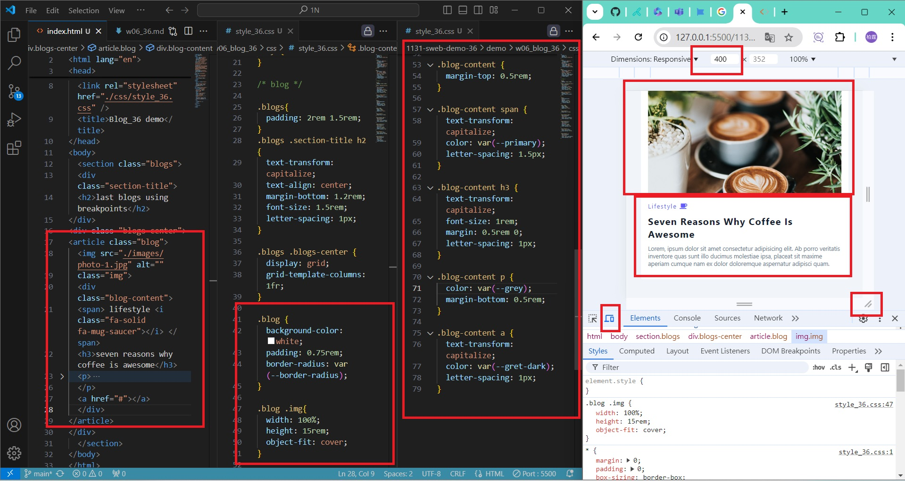

[My Github URL](https://github.com/vincent560/1131-sweb-demo-36.git)

### W06-P1: Create a blog, using html and css as specified
 
 

```
70feb07 vincent560      Thu Oct 17 20:47:15 2024 +0800  ### W06-P1: Create a blog, using html and css as specified
```
 ### W06-P2:show 2 blogs in a roe with media query min-width:550px
 
 ```
a2e01a3 vincent560      Thu Oct 17 21:07:36 2024 +0800  W06-P2:show 2 blogs in a roe with media query min-width:550px
 ```
 ### W06-P3:show 3 blogs in a roe with media query min-width:800px
  
ˋˋˋ
58412d6 vincent560      Thu Oct 17 21:38:42 2024 +0800  ### W06-P3:show 3 blogs in a roe with media query min-width:800px
ˋˋˋ

### W06-P4:show 4 blogs in a roe with media query min-width:1150px

ˋˋˋ
07dd861 vincent560      Thu Oct 17 21:40:21 2024 +0800  ### W06-P4:show 4 blogs in a roe with media query min-width:1150px
ˋˋˋ
### W06-P5:show 5 blogs in a roe with media query min-width:1600px

ˋˋˋ
abe87e4 vincent560      Thu Oct 17 21:51:03 2024 +0800  ### W06-P5:show 5 blogs in a roe with media query min-width:1600px
ˋˋˋ
### W06-P6:show 6 blogs in a roe with media query min-width:2150px

ˋˋˋ
08cceab vincent560      Thu Oct 17 21:52:55 2024 +0800  ### W06-P6:show 6 blogs in a roe with media query min-width:2150px
ˋˋˋ
### W06-P7:git logs of w6

