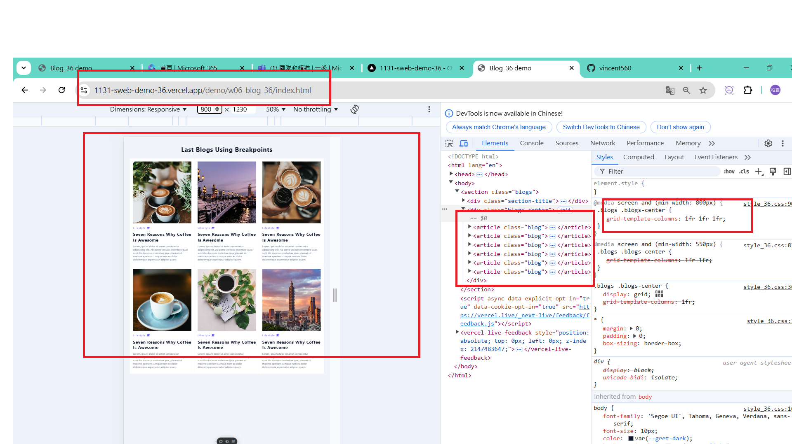
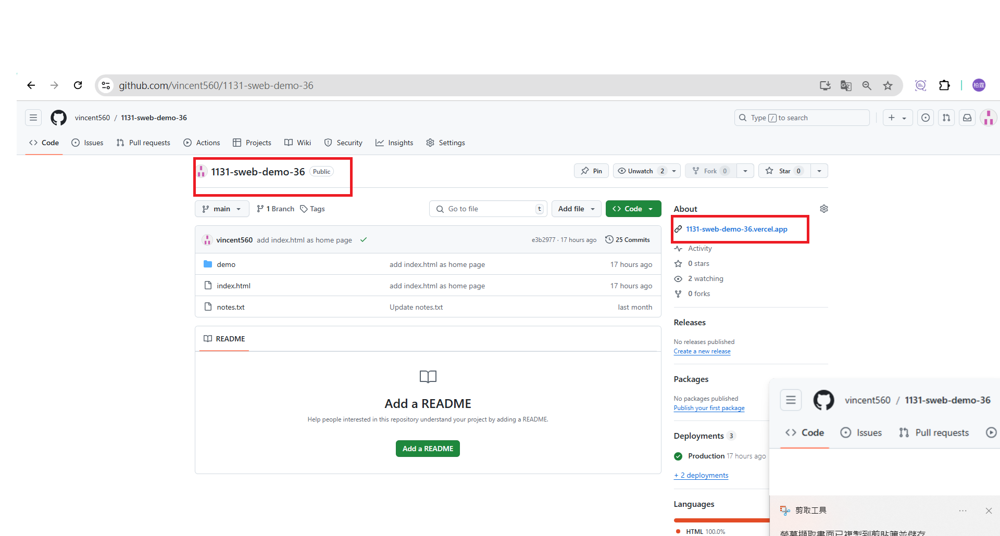
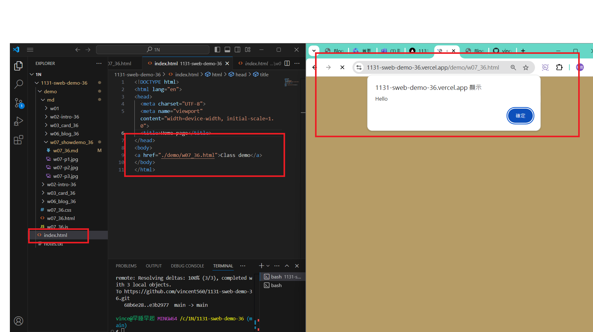
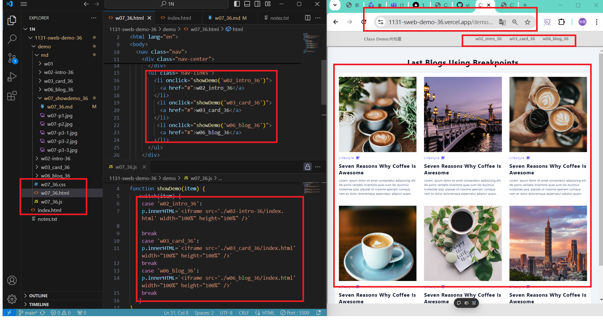
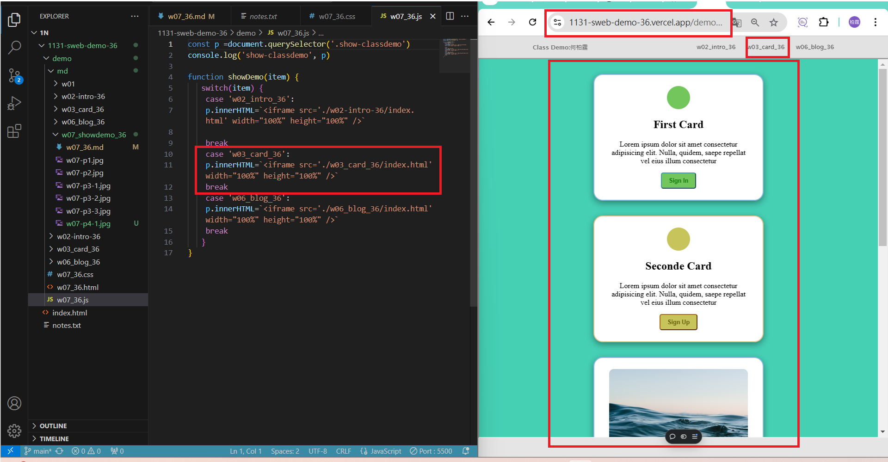

[My Github URL](https://github.com/vincent560/1131-sweb-demo-36.git)

### w07-p1: Test css and js for w07_xx.html
 
ˋˋˋ
5c982cd vincent560      Thu Oct 24 19:15:09 2024 +0800  ### w07-p1: Test css and js for w07_xx.html
ˋˋˋ
### W07-P2: Redo W06-P4 with breakpoints being cancelled
 
ˋˋˋ
68b6e28 vincent560      Thu Oct 24 19:38:07 2024 +0800  ### W07-P2: Redo W06-P4 with breakpoints being cancelled
ˋˋˋ
### W07-P3: Connect your Github repo to Vercel and have a root home page to class demo navigation

#### => In Vercel, show w06 blogs demo


#### => Show your Github repo with Vercel URL
 
[My Vercel URL](https://1131-sweb-demo-36.vercel.app/)



#### => create index.html as root home page and have a link to class demo navigation as done in w07
 

```
95a3707 vincent560      Fri Oct 25 13:52:06 2024 +0800  ### W07-P3: Connect your Github repo to Vercel and have a root home page to class demo navigation
```

### W07-P4: Create navbar with links to class demo w02, w03, w06, and deploy it to Vercel
 
#### => local
 

 
#### => Vercel
 


```
4b47c75 vincent560      Fri Oct 25 14:04:47 2024 +0800  ### W07-P4: Create navbar with links to class demo w02, w03, w06, and deploy it to Vercel
```