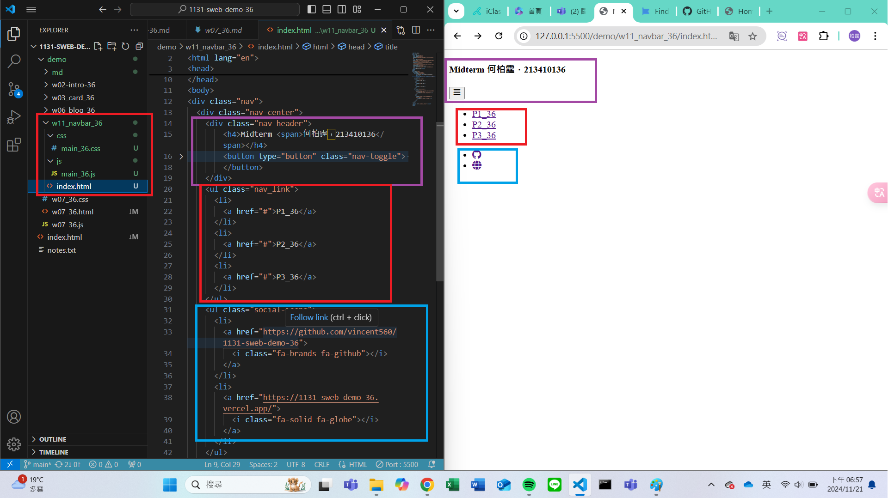
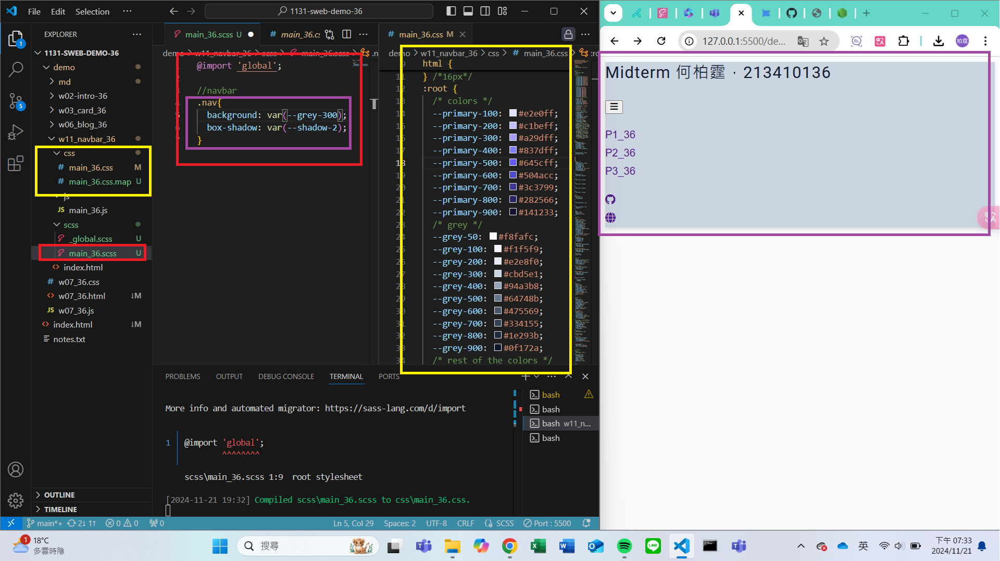

### W11-P1: Create html code for navbar
 

```
fc66cbd vincent560      Thu Nov 21 19:03:21 2024 +0800  ### W11-P1: Create html code for navbar
```

### W11-P2: Use sass to convert scss/main_xx.scss to css/main_xx.css


