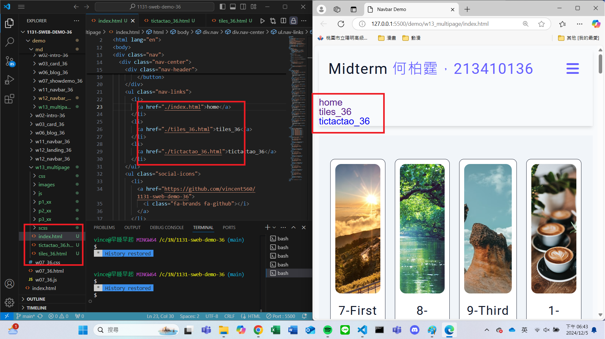
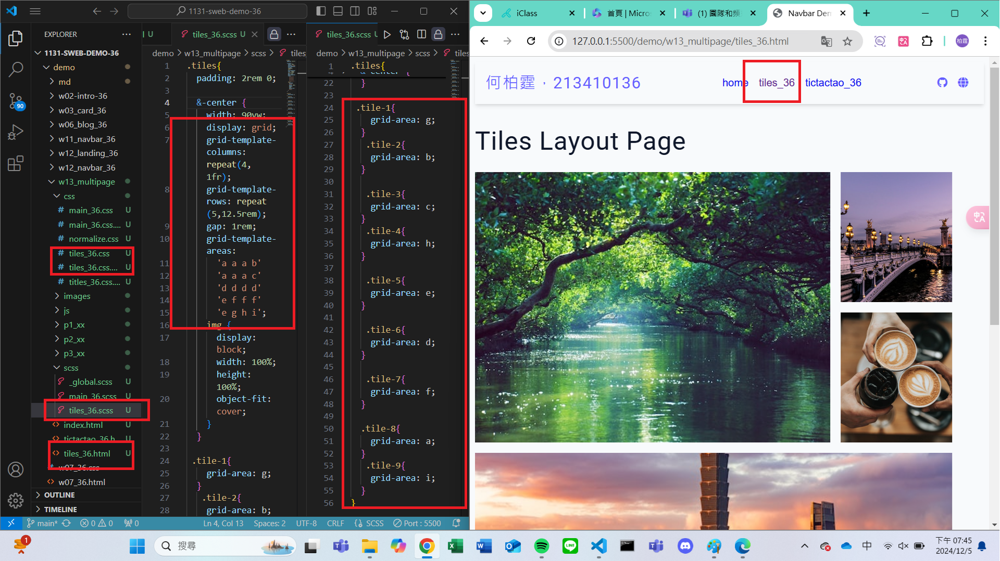
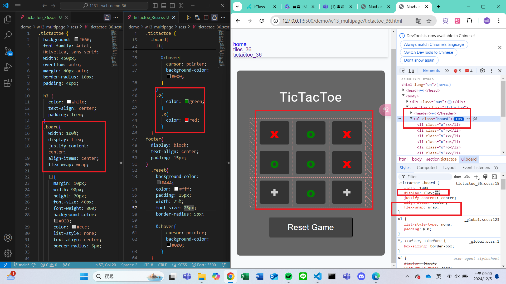

[My Github URL](https://github.com/vincent560/1131-sweb-demo-36.git)

### W13-P1: Create tiles_xx.html and tictactoe_xx.htmml with the same navbar as in index.html

### W13-P2: Make tiles_xx.html work using tiles_xx.scss

### W13-P3: Make tictactoe_xx.html work using tictactoe_xx.scss
 
