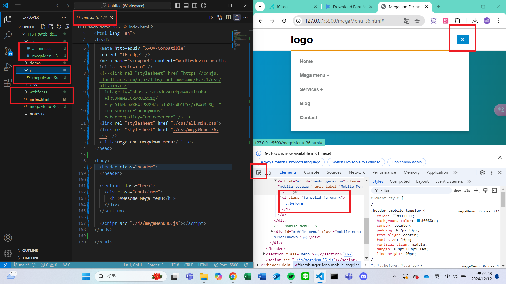
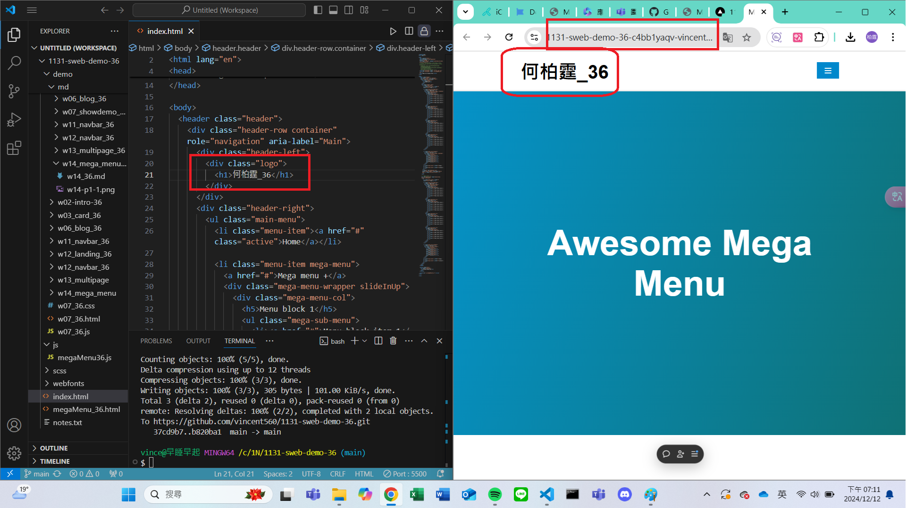
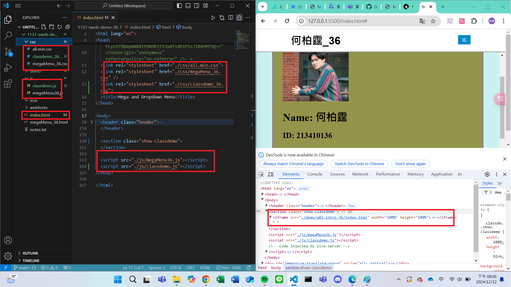
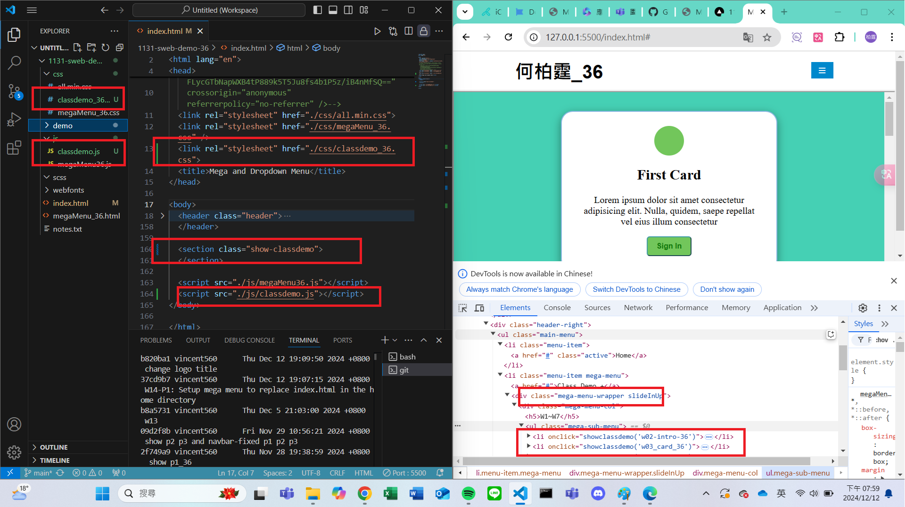
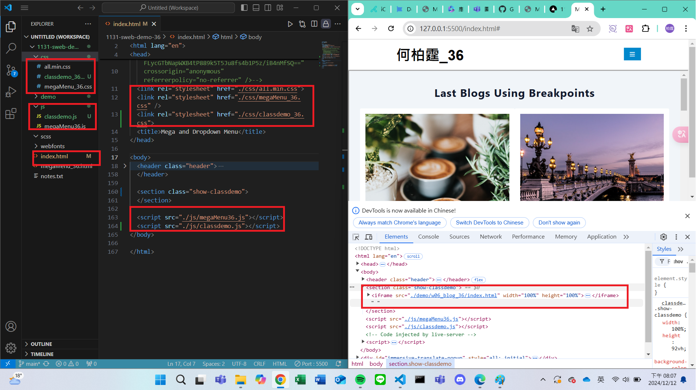
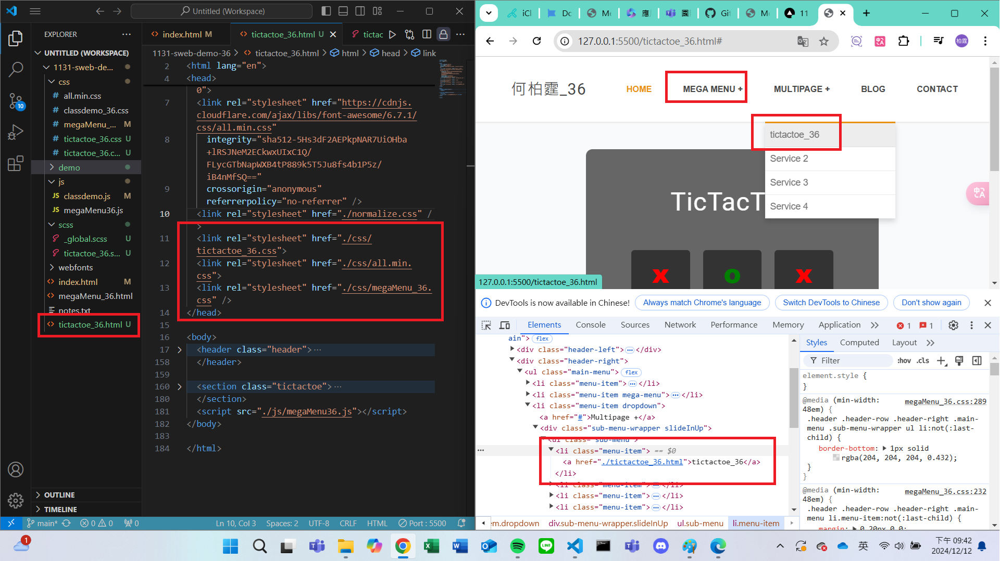
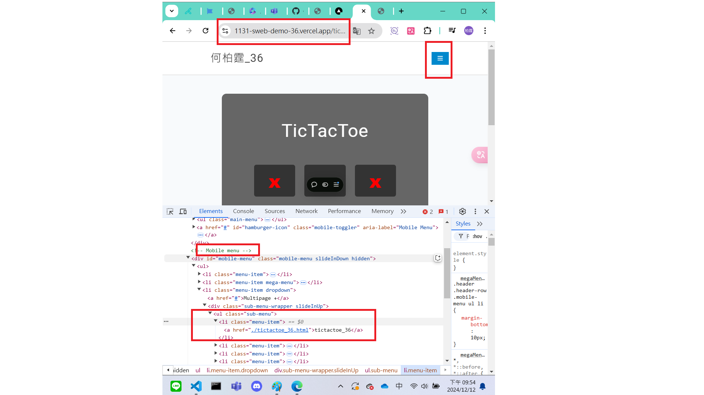
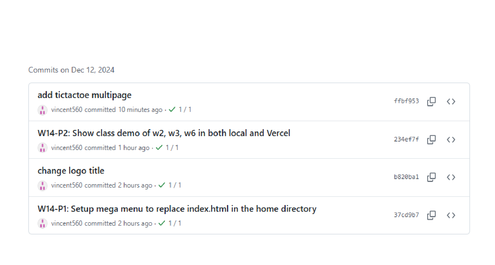

[My Github URL](https://github.com/vincent560/1131-sweb-demo-36.git)

### W14-P1: Setup mega menu to replace index.html in the home directory

#### => Show in local


```
b820ba1 vincent560      Thu Dec 12 19:09:50 2024 +0800  change logo title
37cd9b7 vincent560      Thu Dec 12 19:07:15 2024 +0800  W14-P1: Setup mega menu to replace index.html in the home directory
```

#### => Show in Vercel
 


#### W14-P2: Show class demo of w2, w3, w6 in both local and Vercel
 
#### => Show in local for w2
 

 
#### => Show in local for w3
 

 
#### => Show in Vercel for w6
 

````
234ef7f vincent560      Thu Dec 12 20:09:36 2024 +0800  W14-P2: Show class demo of w2, w3, w6 in both local and Vercel
````

#### W14-P3: Add tictactoe multipage
 
#### => Show in local
 

 
#### => Show in Vercel
 


```
a64aee4 vincent560      Thu Dec 12 21:56:08 2024 +0800  add tictactoe multipage in vercel
ffbf953 vincent560      Thu Dec 12 21:46:54 2024 +0800  add tictactoe multipage
```
#### git log for w14
