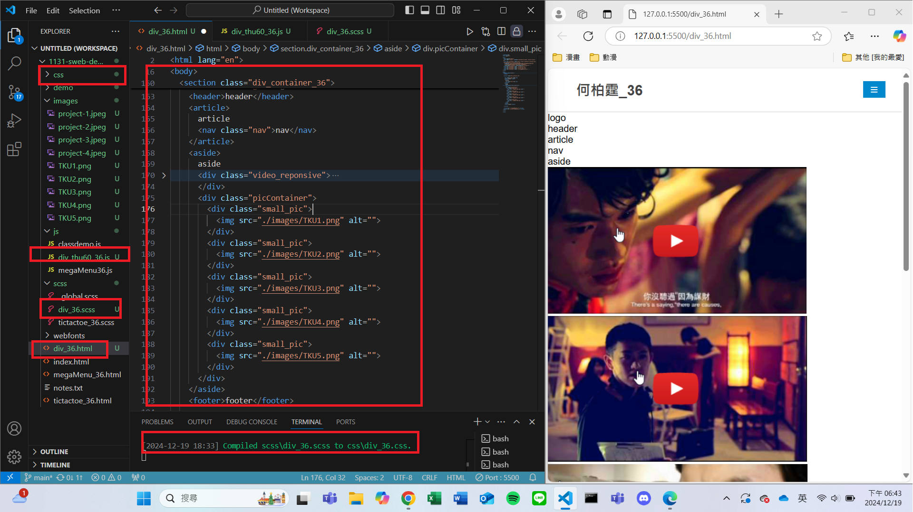
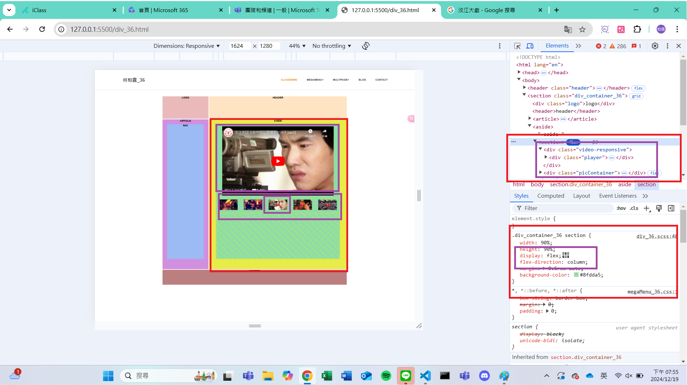
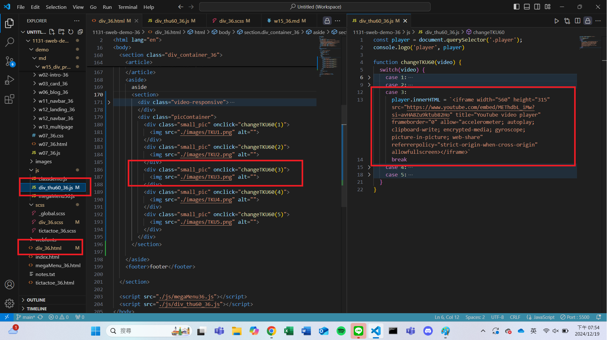

[My Github URL](https://github.com/vincent560/1131-sweb-demo-36.git)

#### W15-P1: Setup div_xx.html, div_xx.scss, div_tku60_xx.js



```
43333f6 vincent560      Thu Dec 19 18:49:23 2024 +0800  W15-P1: Setup div_xx.html, div_xx.scss, div_tku60_xx.js
```
####　W15-P2: Show div_xx.html correctly
 
#### => select tku60 pic 3, and show relevant youtube video
 

 
#### => html, and js code for showing video 3
 


```
b082484 vincent560      Thu Dec 19 20:05:42 2024 +0800  W15-P2: Show div_xx.html correctly
```

#### W15-P3: make P2 div_xx.html responsive
 

 

#### W15-P4: show absolute positioning in project_xx.html
 

 

 